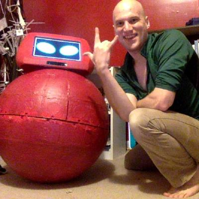

## What is edencybernetics.life?

The main goal of Eden Cybernetics is to use cybernetic organisms I call "daemons" to improve life for the humans and animals living on earth.

## Current/Future Projects

* Augment myself using AI and teach others how to do the same.
* Build a framework for people to easily build custom robots for themselves.
* Improve agriculture on Earth with gardens worked by robots.
* Start agriculture on Mars using robots
* Build a really awesome cybernetics YouTube channel

## Product/Project History

#### Telepresence Bot

#### Humanoid Skeleton with Pneumatic Muscles

#### The kickstarter

The concept of edencybernetics.life started when I began building an AI personality for my BB8 robot. 

Eventually, the AI personality became divorced from the BB8 robot itself and the project took on a life of its own and I had launched a kickstarter for the project.

#### The reflection period 

I tried to collect my thoughts on why the kickstarter failed. At first I thought it was because I was using a lot of APIs and was not doing speech synthesis and speech recognition using my own neural nets. I had learned [neural nets in college](https://github.com/SlightlyCyborg/dart-neuralnet) and used them in small [gardening robot simulations](https://github.com/SlightlyCyborg/gardening_robot), but those used simple fully connected archetectures and standard backpropgation. I sat down and went though Stanfords Conv Net course and [did most of their assignments](https://github.com/SlightlyCyborg/cs231n-assignment2) to gain a more in depth understanding of machine learning. 

#### Small product launch

In the end, I ultimately decided that the reason my kickstarter failed was not that I didn't have enough home made deeplearning, but was rather because I did not embody the AI into a physical product. If I was going to develop open source AI, I needed to put it into a physical computing device so that I have a package to sell it in. 

I developed a very simple robot with a single axis of rotation that can make a laptop with a webcam follow a person when they move out of frame (left or right)

I put that project up on my website and I actually made me a few dollars, just by selling open source hardware files.

#### The Dragon Robot

At this point, I pretty much knew what my business model would be: build a simple robot to install my AI software into and then sell the robot to tech enthusiasts who are interested in having a personal AI.

I began development on my next robot.

At first it was going to be a simple evolution of my swivel bot

However, I ended up taking my design skills as far as I could take them and built a robotic dragon with a cellphone for the CPU and face.

#### The spider bot

The dragon robot was simply too expensive. I needed something cheaper

I began work on a spider robot, but it was too complex and became a dead end.

<blockquote class="twitter-video" data-lang="en">
Added a structure sensor to the spider. <a href="https://t.co/TJKRoZoDmp">pic.twitter.com/TJKRoZoDmp</a>
&mdash; Collin Bell ⓥ/⚛/Ƀ (@SlightlyCyborg) <a href="https://twitter.com/SlightlyCyborg/status/875280630225002496">June 15, 2017</a></blockquote>

#### The IndieGoGo Launch.

On July 14, 2017 I had my first significant success. I built motor mount that can move around the popular Structure Sensor on a 2d axis.

<iframe width="560" height="315" src="https://www.youtube.com/embed/ptE-CMaljYE" frameborder="0" allowfullscreen></iframe>

The launch netted me $228 in revenue, $96 of which is in donations for open sourcing the project. 

2 people bought the product.

Again, it was simply too expensive to build the whole product.

The structure sensor costs > $300. This means that I could only market the device to people who already owned the structure sensor.

#### The TY Beanie Baby Robot.

<blockquote class="twitter-video" data-lang="en">
Too damn cute <a href="https://t.co/w47LxJc6CQ">pic.twitter.com/w47LxJc6CQ</a>
&mdash; Collin Bell ⓥ/⚛/Ƀ (@SlightlyCyborg) <a href="https://twitter.com/SlightlyCyborg/status/886793968872288260">July 17, 2017</a></blockquote>

This robot got >3000 upvotes on [reddit](https://www.reddit.com/r/shittyrobots/comments/6pokmo/i_turned_a_1997_ty_beanie_baby_into_a_shitty_robot/)

There are several things going for this robot as a medium for distributing edencybernetics.life to users.

1. TY Beanie Babies are already a viral meme.
2. They are cheap to get. They are much cheaper than 3d printing a robot body.
3. They come in several varieties. This is in line with the books that inspired this project. In "His Dark Matierals" peoples daemons are embodied in many different forms dependant on the personality of the person.

I have not launched this product yet, but plan on doing so via a YouTube video and ,in the spirit of the 90's, an EBAY listing.

## NYC!!! "Are there any ivestors here" as Collin shouts on the Brooklyn Bridge!
I recently moved to NYC without a plan, except to meet interesting people. I posted an ad on craigslist as a mechetronics engineer and found BJ Henrici who is the great uncle of Alexis Ohanian (the founder of reddit). I promised to do 80 hours/week of work for him as a product manager for the next 6 months. I am developing a laser inspection & microscope inspection system of synthetic fiber producing machinery.

