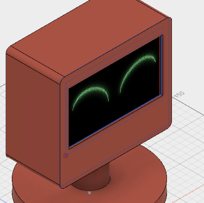
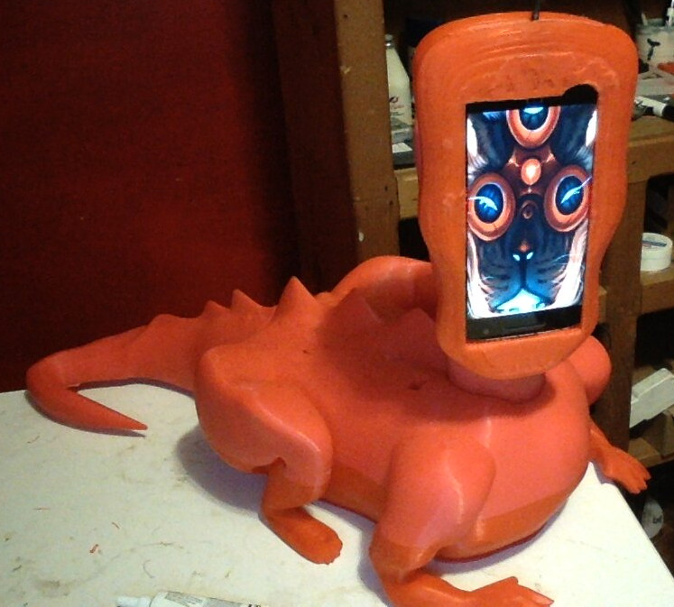

## What is daemon.life?

Futurists like Ray Kurzwiel and Elon Musk predict that in the future, AI and humans will interface so seamlessly with digital computational devices that computer algorithms will feel as if they an inate part of the human mind.

Daemon.life's goal is to develop the algorithms that humans will integrate with and to embody those algorithms within a robotic avitar.

This concept of a daemon was taken from the book series His Dark Materials by Phillip Pullman

## History

#### The kickstarter

The concept of daemon.life started when I began building an AI personality for my BB8 robot. Eventually, the AI personality became divorced from the BB8 robot itself and the project took on a life of its own.

I started hacking on daemon.life in Aug 2016 and by Dec 2016, I had launched a kickstarter for the project.

The kickstarter ultimately failed, but that did not matter much to me. I had resolved to build a robotics and AI company back in 2013, so now in 2016 I wasn't going to let a kickstarter failure get me down.

#### The reflection period 

I tried to collect my thoughts on why the kickstarter failed. At first I thought it was because I was using a lot of APIs and was not doing speech synthesis and speech recognition using my own neural nets. I had learned [neural nets in college](https://github.com/SlightlyCyborg/dart-neuralnet) and used them in small [gardening robot simulations](https://github.com/SlightlyCyborg/gardening_robot), but those used simple fully connected archetectures and standard backpropgation. I sat down and went though Stanfords Conv Net course and [did most of their assignments](https://github.com/SlightlyCyborg/cs231n-assignment2) to gain a more in depth understanding of machine learning. 

#### Small product launch

In the end, I ultimately decided that the reason my kickstarter failed was not that I didn't have enough home made deeplearning, but was rather because I did not embody the AI into a physical product. If I was going to develop open source AI, I needed to put it into a physical computing device so that I have a package to sell it in. 

I developed a very simple robot with a single axis of rotation that can make a laptop with a webcam follow a person when they move out of frame (left or right)

I put that project up on [collinscybernetic.tech](http://collinscybernetic.tech) and it actually made a few dollars, just by selling open source hardware files.

#### The Dragon Robot

At this point, I pretty much knew what my business model would be: build a simple robot to install my AI software into and then sell the robot to tech enthusiasts who are interested in having a personal AI.

I began development on my next robot.

At first it was going to be a simple evolution of my swivel bot

However, I ended up taking my design skills as far as I could take them and built a robotic dragon with a cellphone for the CPU and face.

